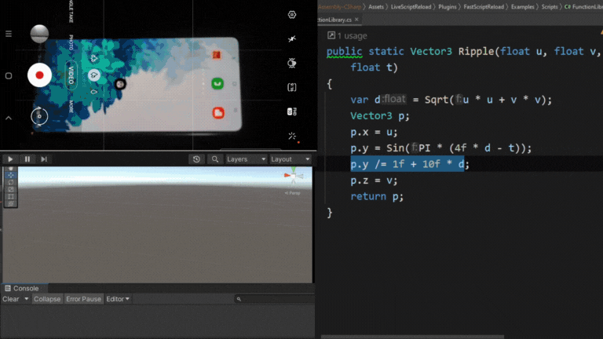

**Are you tired of waiting for full domain-reload and script compilation every time you make a small code change?**

Me too.

[](https://immersivevrtools.com/projects/fast-script-reload?action=play_video "Watch Full Video")
[*Watch Full Video*](https://immersivevrtools.com/projects/fast-script-reload?action=play_video)

# Fast Script Reload
> Iterate on code insanely fast without breaking play session. Supports any editor. 1. Play 2. Make change 3. See results

Tool will automatically compile only what you've changed and immediately hot reload that into current play session.

Iterate on whatever you're working on without reentering play mode over and over again.

And you don't have to adjust your code either, just import.

Works with any code editor.

## Quickstart
1) Download [latest FSR version](https://github.com/handzlikchris/FastScriptReload/releases/download/1.4-rc1/Fast.Script.Reload.unitypackage) and import to Unity
> You can also install via package manager. Window -> Package Manager -> + -> Add package from Git url:
> https://github.com/handzlikchris/FastScriptReload.git?path=Assets
3) Play
3) Make Code Change
4) See results

**It's that simple.**

# Unity Asset Store Best Seller
I was really chuffed to see FSR selling over 1000 copies on [Asset Store](https://assetstore.unity.com/packages/tools/utilities/fast-script-reload-239351?aid=1100ltZSe&pubref=github) in February - propelling it to #1 best-selling for a few days and keeping on first page for most of the month.

Gaining reviews like:
> **Goosebumps and tears of joy**
> 
> Felt like I was underwater and that I can breathe again. Just buy this stuff for any serious project. Working around the limitations is just worth it.

## Hot-Reload in development build (on device)
You can use same hot reload functionality in actual builds / on device. Iterate quickly on deployed Android APK / standalone windows build (exe).

> Currently it's a separate release pack **(that's not as up to date as main FSR)** [you can download it here](https://github.com/handzlikchris/FastScriptReload/releases/download/1.4-rc1/Live.Script.Reload.on.device.Hot-Reload.unitypackage)

## One-off custom code executions on Hot-Reload
When you need to set the stage to test your feature out.

Add following methods to changed script:

```
void OnScriptHotReload()
{
    //do whatever you want to do with access to instance via 'this'
}
```

```
static void OnScriptHotReloadNoInstance()
{
    //do whatever you want to do without instance
    //useful if you've added brand new type
    //or want to simply execute some code without |any instance created.
    //Like reload scene, call test function etc
}
```

## Performance

It's a development tool, you're not supposed to ship with it! :)
Your app performance won't be affected in any meaningful way though.
Biggest bit is additional memory used for your re-compiled code.
Won't be visible unless you make 100s of changes in same play-session.

## Supports (Tested)
- Windows / Mac (Intel editor version only) / Linux
- Unity 2019.3
- Unity 2020.3
- Unity 2021.3
- Unity 2022.2

## Documentation
[Full documentation is available here](Assets/Documentation~/documentation.md)

## Few things to have in mind, limitations:
* most limitations can be overcome with User Defined Script Overrides (see docs for more info)

### Generic methods and classes won't be Hot-Reloaded
Unfortunately generics will not be Hot-Reloaded, to workaround you'd need to move code to non-generic class / method.

### Creating new public methods
Hot-reload for new methods will only work with private methods (only called by changed code)

### Adding new fields (Experimental support added in 1.3)
You can now add new fields and tweak them in editor! Minor limitations:
- outside classes can not call new fields added at runtime
- new fields will only show in editor if they were already used (at least once)

### Extensive use of nested classed / structs
If your code-base contains lots of nested classes - you may see more compilation errors.

### Mac Silicon Editor version not supported
On Mac only Intel Editor version is supported. For Silicon version logs will show that everything is fine but actual change will not happen at runtime

### Other minor limitations
There are some other minor limitations, please consult full list

## Roadmap
> Soon whole roadmap will be published as Github project for better visibility.

- more structured unit-tests, especially around script rewrite 
- add Mac/Linux support - **(DONE, added with 1.1)**
- add debugger support for hot-reloaded scripts **(DONE, added with 1.2)**
- allow to add new fields (adjustable in Editor) **(DONE, added with 1.3)**
- editor mode support **(DONE, added with 1.4)**
- better compiler support to workaround limitations


### FAQ
- My changes no longer automatically compile / reload
> You probably allowed tool to change auto-reload to 'disabled' and have forgotten about it. 
> 
> You can reload changes manually with CTRL+R 
> 
> or reenable auto-reload - please go to `Edit -> Preferences -> Asset Pipeline -> Auto Refresh`and set to `Enabled Outside of Playmode`.
> This way FSR will work in playmode and Unity will do full recompile when you hit 'stop'.

- When importing I'm getting error: 'Unable to update following assemblies: (...)/ImmersiveVRTools.Common.Runtime.dll'
> This happens occasionally, especially on upgrade between versions. It's harmless error that'll go away on play mode.

- When upgrading between versions, eg 1.1 to 1.2 example scene cubes are pink
> This is down to reimporting 'Point' prefab. Right now plugin will make sure it's using correct shader eg. URP / Built-in but only on initial import.

To fix please go to `FastScripReload\Examples\Point\Point.prefab` and search for 'Point' shader.

### Building Hot Reload for Unity - blog posts about technical approach (with code)
I find FSR approach to hot reload very interesting (taking about being biased :)). I'm breaking down technical approach in a blog post series. You can find all about it here:

[1) Building hot reload functionality](https://immersivevrtools.com/Blog/how-to-build-hot-reload-functionality-for-unity) | [Download Example Project Code](_github~/building-hot-reload-for-unity-blog-posts-example-code/01-simple-approach.zip)

[2) Building hot reload for Unity builds / running directly on device](https://immersivevrtools.com/Blog/how-to-build-unity-hot-reload-on-device) | [Download Example Project Code](_github~/building-hot-reload-for-unity-blog-posts-example-code/02-hot-reload-on-device.zip)


# Support the project
If you got this far there's a good chance you're excited about FSR and want to help make it better.
That'd be really cool! There are few things you can do **that make huge difference.**

## Rave about FSR to other game devs!
Spread the word, let other devs know what it is, why is it cool and how it helps build your game.
I'm sure once they try it they'll stay with us!

## Help building it
Ping me on [Discord](https://discord.gg/wBKuEAsKAq) if you've got some time on your hands and would like to contribute! 

Doesn't have to be coding - there's a ton of stuff that can be done. 
Giving feedback on features, reporting issues, helping others  get started or just chatting and helping build FSR community. All that helps a lot!

## Become a patron
I'd love to continue spending most of my time making FSR better, as a indie dev however I need to balance that with paid client work. You can chip in to show your appreciation!

**[Support FSR by becoming a patron!](https://www.patreon.com/FastScriptReload)**

